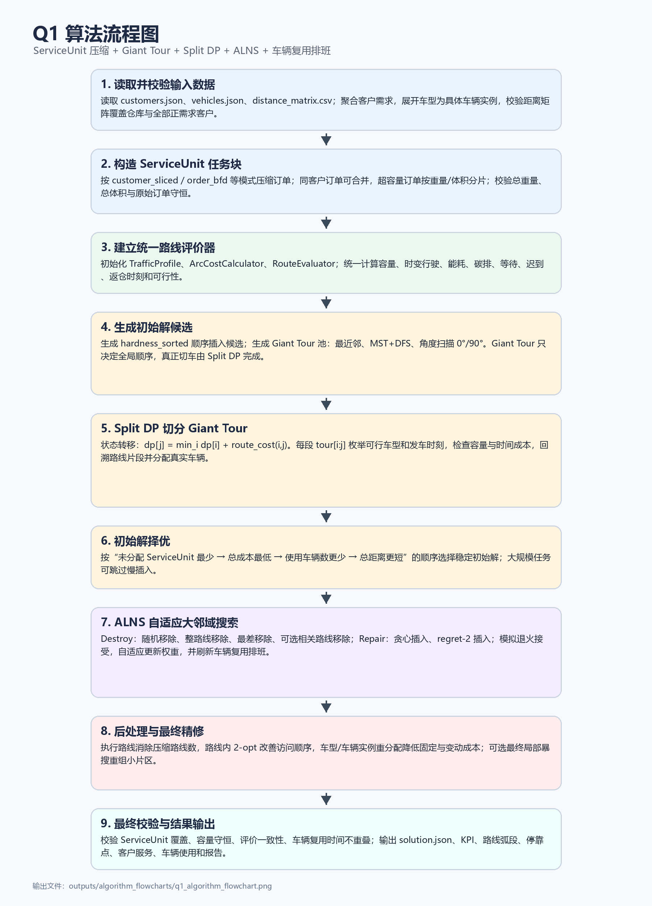

# Q1 算法流程说明

Q1 采用“ServiceUnit 压缩 + Giant Tour + Split DP + ALNS”的两阶段启发式框架。首先从 `cleaned_data` 读取客户、车型和距离矩阵，聚合客户需求并展开具体车辆实例；随后将客户订单压缩为可操作的 `ServiceUnit`，对同一客户的小订单进行合并，对超容量订单按重量或体积分片，并校验总重量、总体积守恒。

在模型评价层，程序建立分段时变速度模型、弧成本模型和统一路线评价器。路线评价器负责计算容量可行性、分时段行驶时间、能耗成本、碳成本、等待成本、迟到成本和返仓时刻，后续构造、搜索和校验均使用同一套评价逻辑。

初始解阶段先生成多个任务顺序候选：难度排序顺序插入、最近邻 Giant Tour、MST + DFS Giant Tour、角度扫描 Giant Tour。对每条 Giant Tour 使用 Split DP 切分为车辆路线，状态转移为 `dp[j] = min_i dp[i] + route_cost(i,j)`，其中 `route_cost(i,j)` 表示将连续片段 `tour[i:j]` 作为一条路线时，在可行车型和发车时刻中取得的最低成本。回溯得到路线片段后，再分配具体车辆并进行车辆复用排班。

所有初始解候选按照“未分配任务最少、总成本最低、使用车辆数更少、总距离更短”的规则择优。随后进入 ALNS 搜索，破坏算子包括随机移除、整路线移除、最差任务移除和可选相关路线移除，修复算子包括贪心插入和 regret-2 插入；搜索过程使用模拟退火接受准则和自适应权重更新，并持续刷新车辆复用时间表。

ALNS 后处理包括路线消除、路线内 2-opt、车型/车辆实例重分配和可选最终局部暴搜。最终解经过覆盖性、容量、路线评价一致性、真实车辆复用时间不重叠等校验后，输出 JSON、KPI、路线弧段、客户停靠、客户服务、车辆使用和报告文件。
