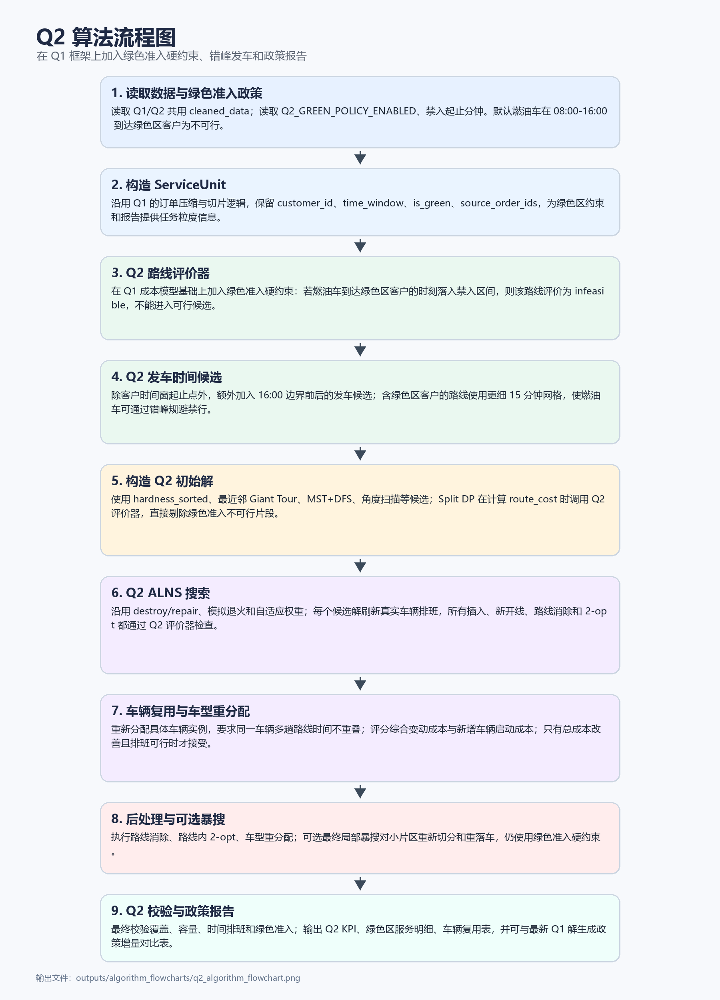

# Q2 算法流程说明

Q2 在 Q1 求解框架上加入绿色准入政策约束。程序仍读取 Q1/Q2 共用的客户、车型和距离矩阵数据，并沿用 ServiceUnit 压缩逻辑；每个任务块保留客户编号、时间窗、绿色区标识和来源订单编号，为绿色准入判断和政策报告提供基础信息。

Q2 的核心变化在路线评价器。除 Q1 的容量、时变行驶、能耗、碳排、等待、迟到和返仓计算外，Q2 将绿色准入作为硬约束处理：当政策启用时，若燃油车在禁入时段内到达绿色区客户，该路线直接判为不可行，而不是简单增加罚分。默认禁入区间为 08:00 至 16:00，可通过环境变量调整。

为提高可行性和降低迟到成本，Q2 扩展了发车时间搜索。普通路线仍使用客户时间窗附近的候选发车时刻；含绿色区客户的路线额外加入 16:00 边界前后的候选点，并采用更细的时间网格，使燃油车可以通过错峰到达规避禁行，新能源车则可在禁入时段内正常服务绿色区客户。

初始解构造仍使用难度排序、最近邻 Giant Tour、MST + DFS Giant Tour 和角度扫描 Giant Tour。Split DP 在计算每个连续片段成本时调用 Q2 路线评价器，因此绿色准入不可行的片段会被直接剔除。候选初始解仍按未分配数、总成本、车辆数和距离择优。

Q2 的 ALNS 沿用 Q1 的破坏修复框架和模拟退火接受准则，但每个候选解都必须通过 Q2 评价器和真实车辆复用排班。车辆重分配阶段会重新选择具体车辆实例，要求同一车辆的多趟路线时间不重叠，并以变动成本加新增车辆启动成本作为主要评分；只有在总成本改善且排班可行时才接受替换。

后处理阶段继续执行路线消除、路线内 2-opt、车型重分配和可选最终局部暴搜。最终输出除常规 KPI、路线、弧段、停靠点和车辆使用文件外，还增加绿色区服务明细、绿色准入违约次数、绿色区燃油/新能源服务次数，并可自动读取最新 Q1 结果生成政策增量对比表。
