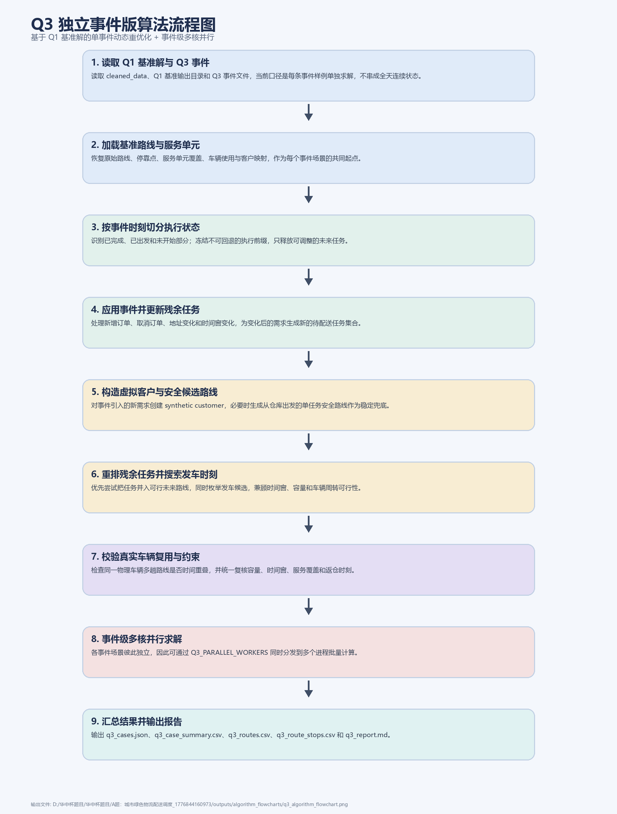

# Q3 独立事件版算法流程说明

本说明对应 `src_q3`。这一版 Q3 的口径是“每条事件样例独立求解”，适合做动态扰动的敏感性分析、方法稳定性验证和多场景并行测试。它不是把全天事件串成连续滚动状态，而是始终从同一个 Q1 基准方案出发，对单条事件做局部重优化。

程序首先读取 `cleaned_data` 中的客户、车辆和事件数据，并加载固定的 Q1 基准输出目录 `outputs/q1/run_20260425_182112`。基准方案中包含原始路线、停靠点、服务单元覆盖关系和车辆使用信息，Q3 在此基础上切分事件时刻前后的执行状态。对于每条事件，系统识别哪些任务已经完成、哪些车辆已经出发、哪些未来路线尚未开始，然后冻结不可更改的执行前缀，只释放仍可调整的残余任务。

事件处理阶段根据类型更新状态。新增订单会被转成新的虚拟客户和服务单元；取消订单会从尚未执行的未来任务中删除；地址变更和时间窗变更则只修改尚未服务的客户映射。为避免污染原始客户数据，Q3 会给事件生成独立的 synthetic customer 标识，并在事件结束后单独记录该场景下的客户集和服务单元集。

残余任务求解阶段采用稳定优先策略。当前实现不会对整天计划做大规模全局重构，而是优先保证“任何事件都能给出合法解”：已在途车辆只能继续执行自身已装载任务；新的或被释放的任务优先尝试并入可用的未来路线；若并入失败，则退化到安全的单任务路线。所有新路线的发车时间都通过时间网格搜索得到，确保尽量满足时间窗与车辆周转约束。

Q3 独立事件版的一个实际优势是可以做事件级多核并行。由于每条事件互不依赖，`Q3_PARALLEL_WORKERS` 可以把多个扰动场景同时分发给多个进程运行，从而显著缩短批量测试时间。这一并行优化只作用于 `src_q3`，不适用于连续滚动版。

最终每个事件场景都会经过统一的路线评价和校验，检查容量、到达时刻、时间窗、服务单元覆盖以及车辆复用时间重叠等约束。程序输出 `q3_cases.json`、`q3_case_summary.csv`、`q3_routes.csv`、`q3_route_stops.csv` 和 `q3_report.md`，用于横向比较不同事件下的成本、路线数、用车数和扰动程度。
