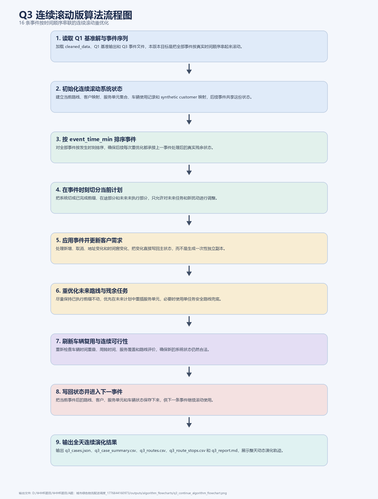

# Q3 连续滚动版算法流程说明

本说明对应 `src_q3_continue`。这一版 Q3 的目标是把事件文件中的多条扰动按真实时间顺序串起来，模拟“同一天内不断有新事件进入系统”的连续重优化过程。与 `src_q3` 相比，它更接近动态调度的真实运行口径。

程序启动后先读取一次 Q1 初始执行方案，并建立可持续更新的系统状态。这个状态不仅包含当前全部路线，还包括客户映射、服务单元集合、车辆使用记录和 synthetic customer 关系。随后算法会按 `event_time_min` 对事件排序，逐条推进，而不是每次都回到同一个 Q1 基准解。

在每个事件时刻，连续版会把当前计划切成三个部分：已经完成的前缀、已经出发但尚未完成的在途部分、以及尚未开始的未来部分。已完成和在途前缀被视为现实执行结果，不能随意回滚；真正可重优化的是事件发生后仍未执行的未来任务，以及这次事件新引入或修改的客户需求。这样处理后，下一次事件看到的就是前一次事件改变后的真实残余状态，而不是理想化的原始方案。

事件本身的处理逻辑与独立事件版一致，包括新增订单、取消订单、地址变化和时间窗变化，但状态更新方式不同。连续版会把每次事件引起的客户变更、服务单元变化和路线替换直接写回主状态，因此后续事件能够继承之前的扰动影响。也正因为如此，连续版后半程往往会出现路线数、车辆数和总成本逐步积累上升的现象，这是一种真实的动态连锁反应。

为了保证稳定性，当前连续滚动版仍采用保守的残余任务重排策略：尽量保持已执行前缀不动，优先在未来计划中重插服务单元，必要时使用单任务安全路线兜底。它的重点是“连续滚动不出错”，而不是在每个事件时刻都做非常激进的全局重构。因此它通常比独立事件版更贴近真实执行，但成本压缩能力暂时更保守。

连续滚动版目前没有启用事件级多核并行，因为每个事件都依赖前一个事件更新后的系统状态，天然是串行链路。它的加速空间主要在单次事件内部的候选发车搜索、局部修复和更高效的数据结构，而不是把事件拆开并行。

最终输出仍包括 `q3_cases.json`、`q3_case_summary.csv`、`q3_routes.csv`、`q3_route_stops.csv` 和 `q3_report.md`。与独立事件版不同，这里的每一条事件结果都代表“经过前面所有事件滚动累积之后”的系统状态，因此更适合在论文里展示全天连续扰动下的演化轨迹。
