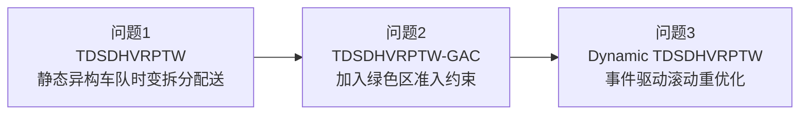
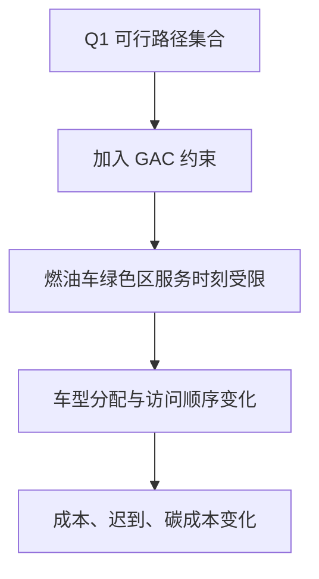
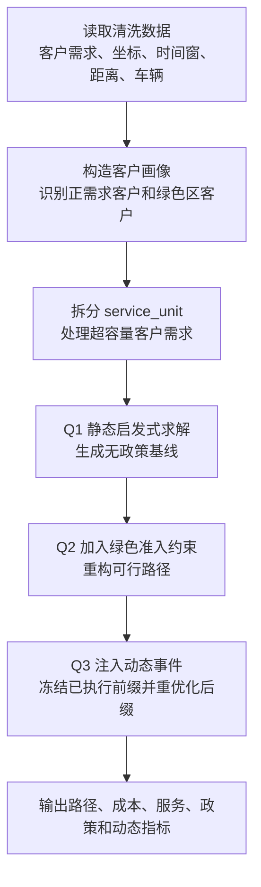
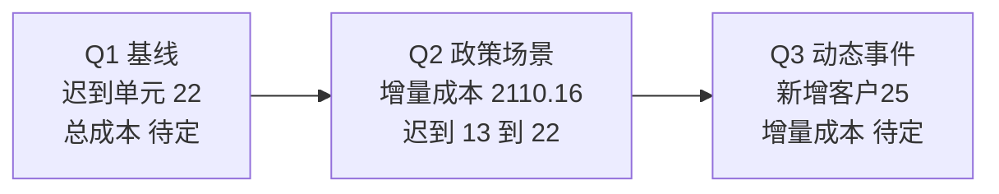

# 城市绿色物流配送调度模型、求解与结果分析（论文版）

> 本文档基于 `analysis/06_model_formulation_pretty(1).md` 改写为论文正文版本。它不是完整数学附录，而是用于论文“模型建立、模型求解、结果分析”章节的可读稿。原模型文件没有明确给出的数值均写为“待定”，并说明后续应填入的结果来源。

## 1 模型思路与问题分析

本题研究城市绿色物流配送调度。配送系统包括一个配送中心、若干客户节点和多类型车辆。客户订单具有重量、体积和时间窗要求，车辆具有重量容量、体积容量、能源类型和启动成本差异；道路运行速度随时段变化，能耗和碳排放又与车辆速度和载荷状态相关。因此，本题不是普通最短路问题，也不是单一同质车队 `CVRP`，而是一个带时变旅行时间、异构车队、双容量、软时间窗、拆分配送和绿色成本的车辆路径优化问题。

三问之间具有明显递进关系。问题1给出无政策限制下的静态配送基准；问题2在问题1基础上加入绿色区燃油车准入限制；问题3在既有静态或政策计划基础上处理动态事件。因此本文采用如下模型链：

其中 `TDSDHVRPTW` 表示 Time-Dependent Split-Delivery Heterogeneous Vehicle Routing Problem with Time Windows；`GAC` 表示 Green Access Constraint，即绿色准入约束。本文把三个问题看作同一主模型的逐步扩展，而不是三个互不相干的独立模型。

建模时作如下核心假设：车辆单日配送，从配送中心 `0` 出发并最终返回；仅正需求客户进入主模型；订单已在数据预处理阶段聚合为客户级重量、体积和时间窗；所有时间变量以 `8:00` 为零点并用小时表示；时段随机速度取均值确定化；允许拆分配送，同一客户可由多辆车共同完成；重量和体积容量同时约束车辆可行性；能耗修正由重量装载率驱动；不考虑途中补能设施。

## 2 符号与核心变量

为便于表述，记全体客户集合为 $N=\{1,2,\ldots,98\}$，正需求客户集合为 $N^+$，配送中心为节点 `0`，节点集合为 $V=\{0\}\cup N^+$，有向弧集合为 $A=\{(i,j)\mid i,j\in V,i\ne j\}$。车辆实例集合为 $M$，燃油车集合为 $M^{fuel}$，新能源车集合为 $M^{elec}$，绿色区正需求客户集合为 $N^{green}$。

主要参数和变量如下。

| 符号 | 含义 |
|---|---|
| $W_j,V_j$ | 客户 $j$ 的重量需求和体积需求 |
| $e_j,l_j$ | 客户 $j$ 的最早、最晚服务时刻 |
| $Q_m^w,Q_m^v$ | 车辆 $m$ 的重量容量和体积容量 |
| $d_{ij}$ | 节点 $i$ 到节点 $j$ 的道路距离 |
| $x_{ijm}$ | 车辆 $m$ 是否直接行驶弧 $(i,j)$ |
| $y_m$ | 车辆 $m$ 是否启用 |
| $\lambda_{jm}$ | 车辆 $m$ 承担客户 $j$ 需求的比例 |
| $q_{ijm}^w,q_{ijm}^v$ | 车辆 $m$ 在弧 $(i,j)$ 上的重量、体积载荷 |
| $t_{jm}$ | 车辆 $m$ 到达客户 $j$ 的时刻 |
| $D_{im}$ | 车辆 $m$ 离开节点 $i$ 的时刻 |
| $\varepsilon_{jm}^+,\varepsilon_{jm}^-$ | 车辆 $m$ 在客户 $j$ 处的等待量和迟到量 |
| $v_{jm}$ | 车辆 $m$ 是否访问客户 $j$ |

访问指示量定义为：

$$
v_{jm}=\sum_{i\in V,i\ne j}x_{ijm}
$$

车辆 $m$ 对客户 $j$ 实际承担的重量和体积为：

$$
\delta_{jm}^w=\lambda_{jm}W_j,\qquad
\delta_{jm}^v=\lambda_{jm}V_j
$$

## 3 问题1：TDSDHVRPTW 静态调度模型

### 3.1 模型目标

问题1要求在无绿色区准入限制的条件下，确定车辆启用方案、客户访问顺序、拆分配送比例、到达时刻和载荷状态，使综合配送成本最小。综合成本包括固定发车成本、能源成本、碳成本、等待成本和迟到惩罚成本。

目标函数为：

$$
\min Z_1=C_{\text{start}}+C_{\text{energy}}+C_{\text{carbon}}+C_{\text{wait}}+C_{\text{late}}
$$

其中：

$$
C_{\text{start}}=\sum_{m\in M}f_my_m
$$

$$
C_{\text{energy}}=
\sum_{m\in M}\sum_{(i,j)\in A}
c_{ijm}^{energy}x_{ijm}
$$

$$
C_{\text{carbon}}=
\sum_{m\in M}\sum_{(i,j)\in A}
c_{ijm}^{carbon}x_{ijm}
$$

$$
C_{\text{wait}}=p^{wait}\sum_{j\in N^+}\sum_{m\in M}\varepsilon_{jm}^+
$$

$$
C_{\text{late}}=p^{late}\sum_{j\in N^+}\sum_{m\in M}\varepsilon_{jm}^-
$$

### 3.2 时变旅行时间与能耗成本

设车辆在时刻 $t$ 离开节点 $i$ 后行驶弧 $(i,j)$，其旅行时间记为：

$$
\tau_{ij}(t)=
\inf\left\{\Delta\ge0:
\int_t^{t+\Delta}v(u)\,du\ge d_{ij}
\right\}
$$

该定义表示车辆按分时段速度函数逐段累计行驶距离，直到累计距离达到道路距离 $d_{ij}$。若一条弧跨越多个速度时段，则旅行时间和能耗均按时段切割计算，而不是只按出发时刻速度近似整条弧。

弧段重量装载率为：

$$
\rho_{ijm}=\frac{q_{ijm}^w}{Q_m^w}
$$

能耗量表示为：

$$
E_{ijm}=E_{ijm}(D_{im},\rho_{ijm})
$$

弧段能源成本、碳排放量和碳成本分别为：

$$
c_{ijm}^{energy}
=E_{ijm}(D_{im},\rho_{ijm})p_m^{energy}
$$

$$
Q_{ijm}^{CO_2}
=E_{ijm}(D_{im},\rho_{ijm})\eta_m^{CO_2}
$$

$$
c_{ijm}^{carbon}
=Q_{ijm}^{CO_2}\pi^{CO_2}
$$

因此，碳成本用于进入目标函数，碳排放量可作为结果分析中的独立环境指标。

### 3.3 主要约束

客户需求必须被完全服务：

$$
\sum_{m\in M}\lambda_{jm}=1,\qquad \forall j\in N^+
$$

车辆只有访问客户时才能承担其需求：

$$
0\le \lambda_{jm}\le v_{jm},\qquad \forall j\in N^+,\forall m\in M
$$

同一车辆对同一客户至多访问一次，并满足进出流平衡：

$$
\sum_{i\in V,i\ne j}x_{ijm}
=
\sum_{l\in V,l\ne j}x_{jlm}
\le1,\qquad \forall j\in N^+,\forall m\in M
$$

车辆从配送中心出发并最终返回配送中心：

$$
\sum_{j\in N^+}x_{0jm}=y_m,\qquad
\sum_{i\in N^+}x_{i0m}=y_m
$$

重量和体积载荷流守恒分别为：

$$
\sum_{i\in V,i\ne j}q_{ijm}^w
-\sum_{l\in V,l\ne j}q_{jlm}^w
=\lambda_{jm}W_j
$$

$$
\sum_{i\in V,i\ne j}q_{ijm}^v
-\sum_{l\in V,l\ne j}q_{jlm}^v
=\lambda_{jm}V_j
$$

容量约束为：

$$
0\le q_{ijm}^w\le Q_m^w x_{ijm},\qquad
0\le q_{ijm}^v\le Q_m^v x_{ijm}
$$

车辆离开客户节点的时刻为：

$$
D_{jm}=t_{jm}+\varepsilon_{jm}^++s_jv_{jm}
$$

时间传播约束为：

$$
t_{jm}\ge D_{im}+\tau_{ij}(D_{im})-\Omega(1-x_{ijm})
$$

软时间窗约束为：

$$
\varepsilon_{jm}^+\ge e_j-t_{jm}-\Omega(1-v_{jm})
$$

$$
\varepsilon_{jm}^-\ge t_{jm}-l_j-\Omega(1-v_{jm})
$$

为避免客户子回路，引入路径序号变量 $u_{jm}$：

$$
0\le u_{jm}\le n^+v_{jm}
$$

$$
u_{im}-u_{jm}+n^+x_{ijm}\le n^+-1
$$

上述模型直接在客户节点层刻画拆分配送。由于 $\tau_{ij}(D_{im})$ 和 $E_{ijm}(D_{im},\rho_{ijm})$ 均依赖决策变量，原始模型是混合整数非线性优化模型。实际计算时将客户需求离散为 `service_unit`，用启发式算法获得近似解。

## 4 问题2：TDSDHVRPTW-GAC 政策约束模型

### 4.1 模型思路

问题2在问题1的基础上加入绿色配送区准入规则。绿色区客户集合按清洗后坐标口径确定，且只把正需求客户纳入 $N^{green}$。政策只限制燃油车，新能源车不受该准入约束影响。

由于全文采用相对 `8:00` 的小时数表示时间，`16:00` 对应 $t=8$。配送计划从 `8:00` 开始，因此题面“燃油车 8:00-16:00 禁入绿色区”可等价写为：若燃油车服务绿色区客户，则其到达时刻不得早于 $8$。

### 4.2 绿色准入约束

对所有绿色区客户和燃油车，有：

$$
t_{jm}\ge 8-\Omega(1-v_{jm}),
\qquad \forall j\in N^{green},\forall m\in M^{fuel}
$$

当 $v_{jm}=1$ 时，上式强制燃油车在 `16:00` 后到达绿色区客户；当 $v_{jm}=0$ 时，约束自动松弛。

问题2的目标函数保持与问题1相同：

$$
\min Z_2=C_{\text{start}}+C_{\text{energy}}+C_{\text{carbon}}+C_{\text{wait}}+C_{\text{late}}
$$

因此，问题2不是重新构造一套目标函数，而是在问题1约束基础上加入 GAC 约束，改变可行域。该约束会影响车型分配、客户访问顺序、等待与迟到结构，并进一步影响能源成本和碳成本。

## 5 问题3：Dynamic TDSDHVRPTW 动态重优化模型

### 5.1 动态状态描述

问题3考虑新增订单、取消订单、地址变化和时间窗变化等事件。事件发生时，不重新计算全日路径，而是冻结已经完成的路径前缀，只对当前时刻之后尚未执行的部分进行滚动重优化。

在事件时刻 $t_r$，系统状态表示为：

$$
\mathcal S(t_r)=
\big(
M^{act}(t_r),N^{done}(t_r),N^{part}(t_r),N^{todo}(t_r),
\bar W(t_r),\bar V(t_r),N^{new}(t_r),
\Pi^{fix}(t_r),\Pi^{old,rem}(t_r)
\big)
$$

其中 $M^{act}(t_r)$ 表示仍可调度车辆状态，$N^{done}(t_r)$ 表示已完成客户集合，$\bar W(t_r),\bar V(t_r)$ 表示剩余需求，$\Pi^{fix}(t_r)$ 表示已执行路径前缀。

剩余待服务集合为：

$$
N^{rem}(t_r)=
\{j\in N^+\cup N^{new}(t_r)\mid
\bar W_j(t_r)>0\ \text{或}\ \bar V_j(t_r)>0\}
$$

每辆车的残余节点集和弧集为：

$$
V_m^{(r)}=\{o_m(t_r)\}\cup N^{rem}(t_r)\cup\{0\}
$$

$$
A_m^{(r)}=\{(i,j)\mid i,j\in V_m^{(r)},i\ne j\}
$$

这样可以保证车辆 $m$ 只能从自身当前有效位置 $o_m(t_r)$ 出发，不能从其他车辆位置开始重优化。

### 5.2 动态目标函数

动态重优化目标为：

$$
\min Z_3
=C_{\text{rem}}^{(r)}
+C_{\text{delay}}^{(r)}
+C_{\text{wait}}^{(r)}
+C_{\text{late}}^{(r)}
+C_{\text{disrupt}}^{(r)}
$$

剩余任务成本为：

$$
C_{\text{rem}}^{(r)}
=
\sum_{m\in M^{act}(t_r)}f_m^{(r)}y_m^{(r)}
+\sum_{m\in M^{act}(t_r)}
\sum_{(i,j)\in A_m^{(r)}}
\left(c_{ijm}^{energy,(r)}+c_{ijm}^{carbon,(r)}\right)x_{ijm}^{(r)}
$$

其中 $f_m^{(r)}$ 为残余启动成本。若车辆在事件前已经启动，则 $f_m^{(r)}=0$；若车辆在重优化后才启用，则 $f_m^{(r)}=f_m$。

新增订单响应延迟成本为：

$$
C_{\text{delay}}^{(r)}
=
\sum_{j\in N^{new}(t_r)}p_j^{delay}R_j^{(r)}
$$

路径扰动成本可写为：

$$
C_{\text{disrupt}}^{(r)}
=p^{chg}\sum_{m\in M^{act}(t_r)}
\sum_{(i,j)\in A_m^{(r)}}
\left|x_{ijm}^{(r)}-\hat x_{ijm}^{rem}(t_r)\right|
$$

该项用于抑制重优化对原计划后缀的过度改变。

### 5.3 事件更新机制

动态事件统一写为：

$$
\mathcal S(t_r^+)=
\Phi(\mathcal S(t_r^-),\mathcal E(t_r))
$$

四类事件分别处理如下。

新增订单：若新增客户或新增需求为 $j^*$，则将 $j^*$ 加入新增任务集合，并补充其重量、体积、坐标、时间窗和绿色区标记。

$$
N^{new}(t_r^+)=N^{new}(t_r^-)\cup\{j^*\}
$$

取消订单：若客户 $j^*$ 的未执行需求取消，则将其剩余需求置零；若其尚未被服务，则从剩余任务集合中移除。

$$
\bar W_{j^*}(t_r^+)=0,\qquad
\bar V_{j^*}(t_r^+)=0
$$

地址变化：更新客户坐标，并重新计算距离矩阵、旅行时间函数和能耗成本函数中与该客户相关的行列。

时间窗变化：更新客户时间窗 $[e_{j^*},l_{j^*}]$，随后按新时间窗重新计算等待和迟到。

已完成路径前缀不再进入残余决策变量；在途车辆不可中断当前弧段，只能在完成该弧后进入后续优化。

## 6 求解步骤设计

本文采用“数据标准化 + service_unit 离散化 + 启发式构造路径 + 政策重规划 + 动态滚动重优化”的求解流程。

具体步骤如下。

第一步，读取清洗后数据，包括客户需求表、客户画像表、车辆表和距离矩阵表。将客户订单聚合为客户级重量和体积需求，并只将正需求客户纳入主模型。

第二步，根据车辆最大重量容量和最大体积容量，将客户需求拆分为若干 `service_unit`。该步骤对应数学模型中的拆分配送比例 $\lambda_{jm}$，用于把连续拆分配送思想转化为可执行任务单元。

第三步，构造问题1静态路径。启发式算法按客户时间窗、距离、容量和软时间窗惩罚选择车辆与下一个服务单元，逐步形成车辆路径，并累计启动成本、能耗成本、碳成本、等待成本和迟到成本。

第四步，构造问题2政策路径。对燃油车服务绿色区客户的候选动作施加 GAC 过滤，若燃油车在 `8:00-16:00` 到达绿色区客户，则该服务关系不可行。随后重新生成路径并与问题1结果比较。

第五步，构造问题3动态场景。在事件发生时，冻结已完成路径，更新剩余需求和车辆状态，对尚未执行的任务重新插入或重排，并计算动态增量成本和路径扰动。

第六步，进行结果校验。检查客户服务覆盖率、容量约束、绿色准入违约次数、成本非负性和输出文件完整性。

## 7 求解结果与分析

本节仅使用 `06_model_formulation_pretty(1).md` 中已明确写出的结果信息。原文件未明确给出的指标在下表中标为“待定”，后续应由结果文件或图表补充。

| 问题 | 结果链条 | 已知结果 | 待补充内容 |
|---|---|---|---|
| 问题1 | baseline confirmed | 迟到单元数为 `22`，混合使用燃油与新能源大车，综合总成本最低 | 路线数、总成本、五类成本分项、车辆使用结构、碳排放量 |
| 问题2 | q2_policy_candidate confirmed | 候选链口径下政策成本增量约 `2110.16`，迟到单元数由 `13` 增至 `22` | 绿色区客户服务车型结构、政策前后成本分项、碳排放变化 |
| 问题3 | baseline 动态链保留 | 已跑新增客户 `25` 的紧急剩余需求事件样例 | 事件前后路径变化、动态增量成本、扰动幅度、响应成功率 |

从结果解释角度看，问题1结果用于给出无政策情形下的成本基准和车辆路径方案；问题2结果用于衡量绿色区准入政策对总成本、车型结构和服务时效的影响；问题3结果用于说明当配送过程中出现动态事件时，模型如何在不回滚已执行路径的前提下调整后续路径。

需要注意，问题2中的 `2110.16` 是 `q1_static_candidate -> q2_policy_candidate` 的同一候选链比较口径，不应与问题1 baseline 结果混用。若论文最终采用问题1 baseline 作为基准，应重新计算：

$$
\Delta Z_{21}=Z_2-Z_1
$$

并在结果表中明确比较口径。

## 8 评价指标体系

为比较三问结果，本文设置以下指标。

成本类指标包括总成本、固定发车成本、能源成本、碳成本、等待成本和迟到成本：

$$
Z=C_{\text{start}}+C_{\text{energy}}+C_{\text{carbon}}+C_{\text{wait}}+C_{\text{late}}
$$

碳排放量单独报告为：

$$
Q^{CO_2}=\sum_{m\in M}\sum_{(i,j)\in A}Q_{ijm}^{CO_2}x_{ijm}
$$

服务类指标包括任务完成率、未分配任务数和迟到单元数。任务完成率可写为：

$$
R_{\text{task}}
=
\frac{\sum_{j\in N^+}\sum_{m\in M}\lambda_{jm}}{n^+}
$$

由于理论模型中有 $\sum_m\lambda_{jm}=1$，只要模型可行，$R_{\text{task}}$ 恒等于 `1`。因此该指标在严格模型中主要作为可行性门禁，在启发式执行结果或允许未分配任务时才具有区分度。

政策类指标包括绿色区燃油车违约次数、绿色区新能源服务占比和政策增量成本：

$$
N_{\text{viol}}^{green}
=
\sum_{j\in N^{green}}\sum_{m\in M^{fuel}}
\mathbf 1\{v_{jm}=1,t_{jm}<8\}
$$

动态类指标包括动态增量成本、事件响应成功率和路径扰动幅度。

## 9 可视化与图表安排

论文中建议至少包含以下图表。

| 图表 | 内容 | 当前状态 |
|---|---|---|
| 图1 | 三问模型递进关系图 | 已在本文用 Mermaid 给出 |
| 图2 | 求解流程图 | 已在本文用 Mermaid 给出 |
| 图3 | Q1 车辆路径图 | 待定：由 `q1_route_plan.csv` 绘制 |
| 图4 | Q1/Q2 成本分项柱状图 | 待定：填入启动、能耗、碳、等待、迟到成本 |
| 图5 | Q2 车型结构变化图 | 待定：展示燃油车和新能源车使用数量变化 |
| 图6 | Q3 动态事件前后路径图 | 待定：展示新增客户 `25` 事件前后路径调整 |

## 10 小结

本文围绕 `TDSDHVRPTW` 建立了城市绿色物流配送调度模型。问题1构造无政策情形下的静态基准；问题2加入绿色区燃油车准入约束，分析政策对成本、车型结构和服务质量的影响；问题3在动态事件发生时，冻结已执行路径并对剩余任务滚动重优化。模型既保留了车辆路径问题的核心约束，又体现了时变路况、拆分配送、双容量、能耗碳排和绿色准入政策等题面要素。后续论文定稿时，应将路径图、成本分解图、车型结构图和动态事件图补入，并用实际结果文件填充表中“待定”指标。
